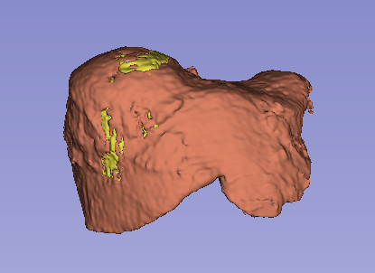
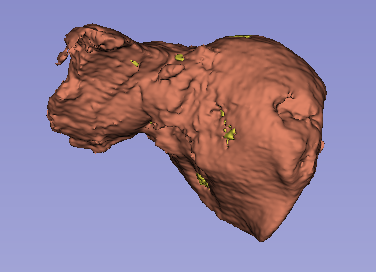
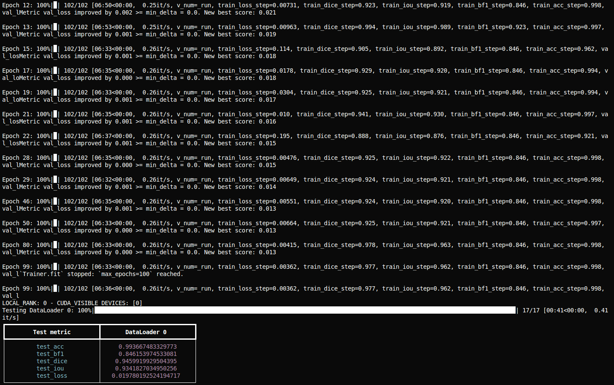

# 3D Segmentation of Liver and Tumor

A modular, extensible, and production-ready framework for 3D CT scan segmentation using PyTorch Lightning, TorchIO, and modern deep learning best practices.  
Supports preprocessing, training, prediction, and evaluation for medical image segmentation tasks.

---

## Features

- **Modular Pipelines**: Separate, reusable modules for data preprocessing, model training, prediction, and evaluation.
- **Model Agnostic**: Easily plug in new models (e.g., DFormer3D, UNet3D) via a registry.
- **Config-Driven**: All stages are configurable via dataclasses and/or JSON files.
- **PyTorch Lightning**: Robust training, logging, checkpointing, and mixed-precision support.
- **TorchIO**: Efficient 3D medical image loading, augmentation, and batching.
- **Metrics**: Dice, IoU, Boundary F1, and accuracy—per-class (liver, tumor) and overall.
- **CLI Entrypoints**: User-friendly command-line interfaces for all stages.
- **Reproducible**: Seeded runs, deterministic options, and clear logging.

---

## Outputs

### 3D-outputs:



### Training output


---
## Project Structure

```
CT-SCAN-SEGMENTATION/
│
├── configs/
│   ├── data_preprocessing_config.py
│   ├── model_training_config.py
│   ├── model_prediction_config.py
│   └── model_evaluation_config.py
│
├── data_preprocessing/
│   └── ... (handlers, normalizers, etc.)
│
├── model_training/
│   ├── trainer.py
│   ├── lightning_module.py
│   ├── losses.py
│   ├── optimizers.py
│   ├── metrics.py
│   └── callbacks.py
│
├── model_prediction/
│   ├── predictor.py
│   └── data.py
│
├── model_evaluation/
│   ├── evaluator.py
│   └── metrics.py
│
├── models/
│   └── ... (DFormer3D, UNet3D, etc.)
│
├── pipelines/
│   ├── data_loading_pipeline.py
│   ├── data_preprocessing_pipeline.py
│   ├── model_training_pipeline.py
│   ├── model_prediction_pipeline.py
│   └── model_evaluation_pipeline.py
│
├── run_data_preprocessing.py
├── run_training.py
├── run_prediction.py
├── run_evaluation.py
└── README.md
```

---

## Setup

1. **Install dependencies** (recommended: use a virtual environment):
    ```bash
    pip install torch torchvision torchaudio pytorch-lightning torchio nibabel scikit-image pandas scipy
    ```

2. **(Optional) Install MONAI** if you want to use MONAI models or transforms:
    ```bash
    pip install monai
    ```

---

## Data Preparation

- Place your raw CT data in the appropriate directory.
- Configure preprocessing parameters in `configs/data_preprocessing_config.py`.
- Run preprocessing:
    ```bash
    python run_data_preprocessing.py --config configs/data_preprocessing_config.py
    ```

---

## Training

- Configure model and training parameters in `configs/model_training_config.py`.
- Train your model:
    ```bash
    python run_training.py --model_name dformer3d --gpus 1 --run_name my_experiment
    ```
- Checkpoints and logs will be saved as configured.

---

## Prediction

- Configure prediction parameters in `configs/model_prediction_config.py`.
- Run prediction:
    ```bash
    python run_prediction.py --checkpoint_path checkpoints/last.ckpt --input_dir data_preprocessed/test --output_dir predictions --device cuda --model_name dformer3d
    ```

---

## Evaluation

- Configure evaluation parameters in `configs/model_evaluation_config.py`.
- Run evaluation:
    ```bash
    python run_evaluation.py --pred_dir predictions --gt_dir data_preprocessed/test --print_summary --save_csv
    ```
- The script prints per-class and overall metrics (Dice, IoU, Boundary F1, Accuracy) and saves results to CSV.

---

## Extending the Framework

- **Add a new model**: Implement your model class and register it in the model registry in the relevant pipeline.
- **Add new metrics**: Implement in `model_training/metrics.py` or `model_evaluation/metrics.py`.
- **Custom data**: Implement new handlers in `data_preprocessing/` as needed.

---

## Best Practices

- Use batch size 1 for large 3D volumes to avoid OOM errors.
- Use mixed precision (`precision=16-mixed`) for efficient training.
- Always check that your input sizes are compatible with your model's architecture.
- Use the provided CLI tools for reproducible, configurable experiments.

---

## Example End-to-End Workflow

```bash
# 1. Preprocess data
python run_data_preprocessing.py --config configs/data_preprocessing_config.py

# 2. Train model
python run_training.py --model_name dformer3d --gpus 1 --run_name my_experiment

# 3. Predict on test set
python run_prediction.py --checkpoint_path checkpoints/last.ckpt --input_dir data_preprocessed/test --output_dir predictions --device cuda --model_name dformer3d

# 4. Evaluate predictions
python run_evaluation.py --pred_dir predictions --gt_dir data_preprocessed/test --print_summary --save_csv
```

---

## Citations

```
@article{dformer,
  title={D-former: A u-shaped dilated transformer for 3d medical image segmentation},
  author={Wu, Yixuan and Liao, Kuanlun and Chen, Jintai and Wang, Jinhong and Chen, Danny Z and Gao, Honghao and Wu, Jian},
  journal={Neural Computing and Applications},
  pages={1--14},
  year={2022},
  publisher={Springer}
}
 ```

```
@inproceedings{xie2021segformer,
  title={SegFormer: Simple and Efficient Design for Semantic Segmentation with Transformers},
  author={Xie, Enze and Wang, Wenhai and Yu, Zhiding and Anandkumar, Anima and Alvarez, Jose M and Luo, Ping},
  booktitle={Neural Information Processing Systems (NeurIPS)},
  year={2021}
}
```

```
@article{chen2021transunet,
  title={TransUNet: Transformers Make Strong Encoders for Medical Image Segmentation},
  author={Chen, Jieneng and Lu, Yongyi and Yu, Qihang and Luo, Xiangde and Adeli, Ehsan and Wang, Yan and Lu, Le and Yuille, Alan L., and Zhou, Yuyin},
  journal={arXiv preprint arXiv:2102.04306},
  year={2021}
}
```

---

## License

This project is licensed under MIT License.

---

**For questions, issues, or contributions, please open an issue or pull request.** 
